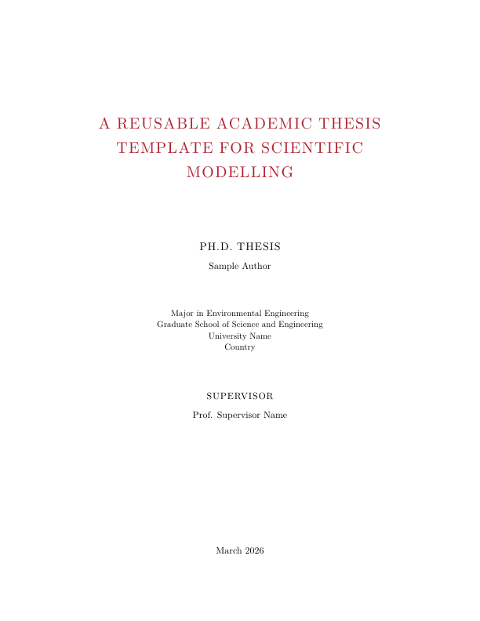
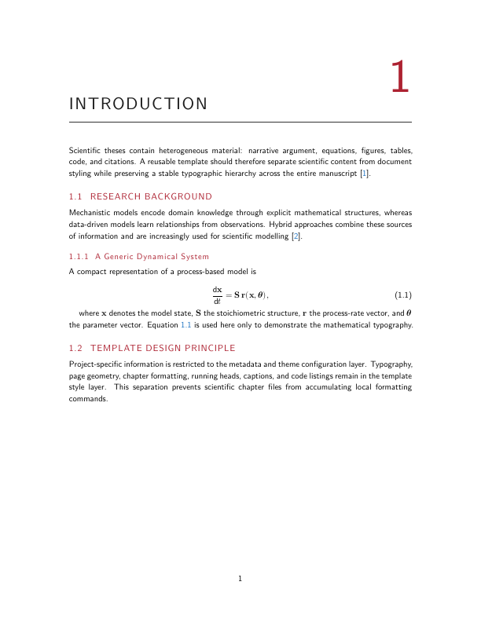
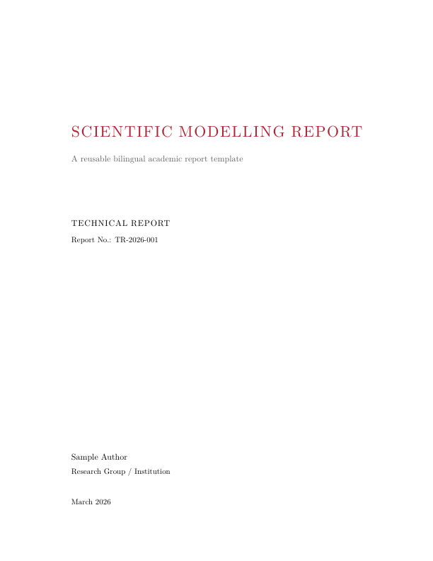
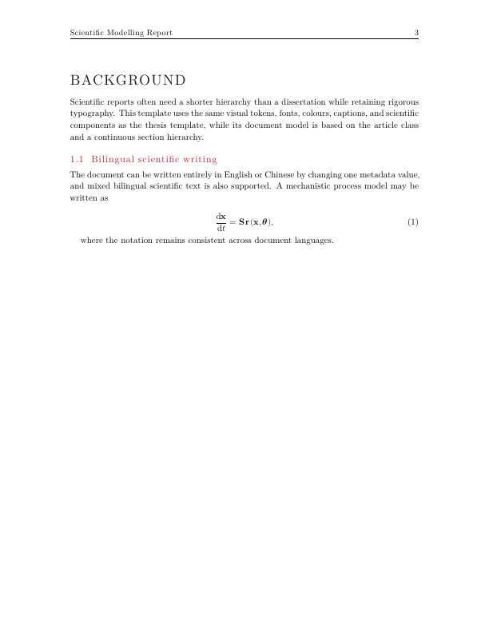
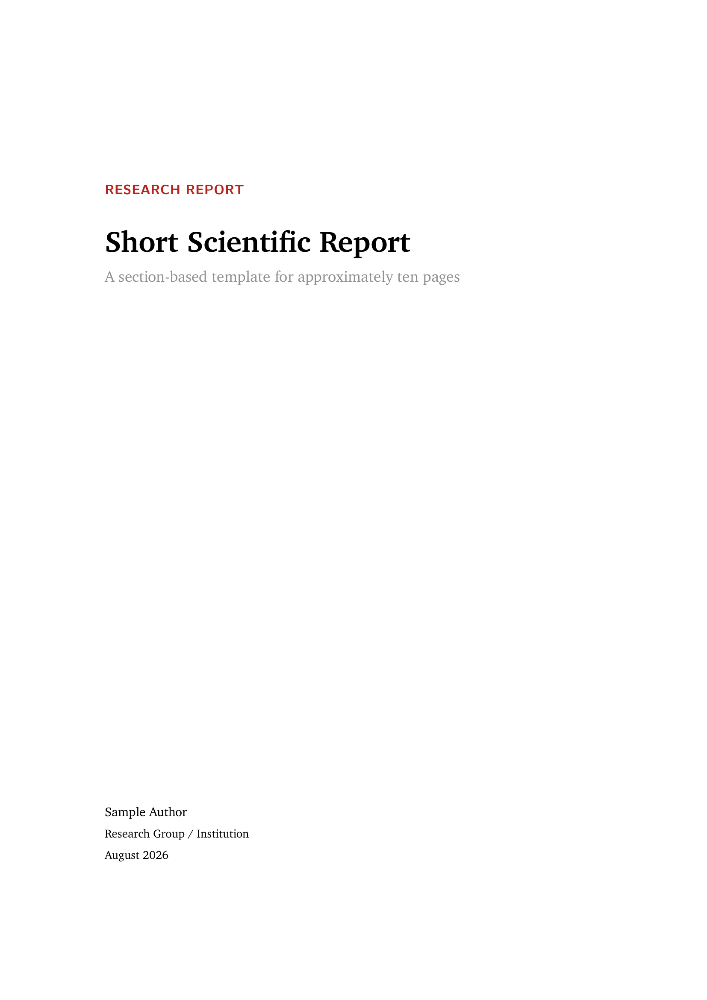
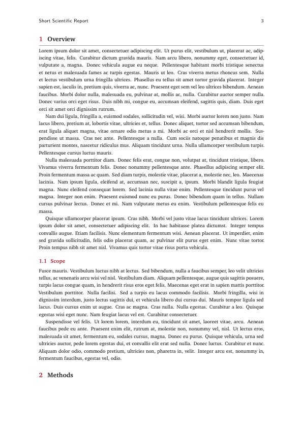
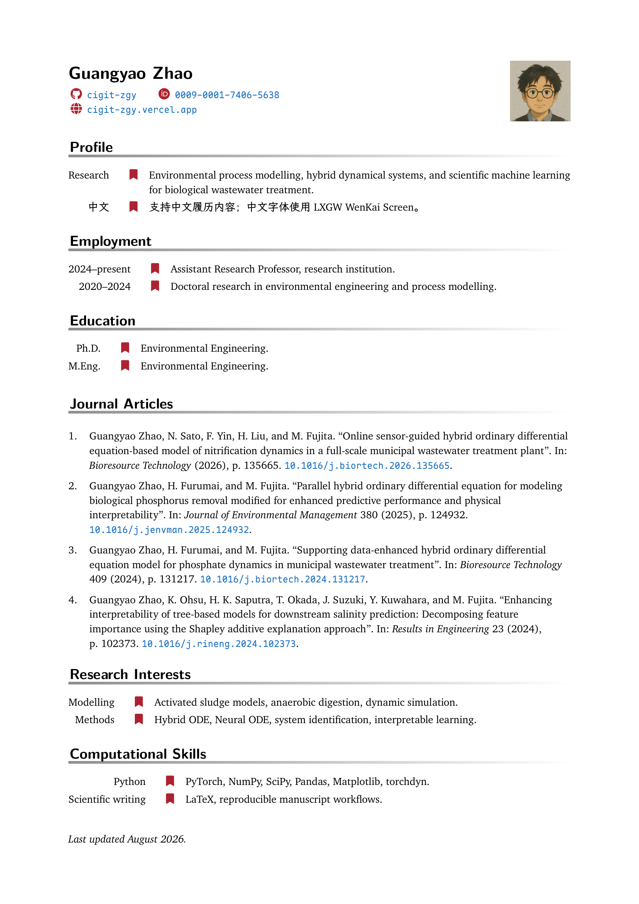

# LaTeX Templates

A curated collection of reusable LaTeX templates for academic writing. Templates are organized by **document type first**, then by **visual family**. Every template is self-contained and can be copied independently.

## Templates

| Type | Template | Engine | Structure | Languages |
| --- | --- | --- | --- | --- |
| Thesis | [`classic-academic`](thesis/classic-academic/) | XeLaTeX | Book / dissertation | English + 中文 |
| Report | [`classic-academic`](report/classic-academic/) | XeLaTeX | Full scientific / technical report | English + 中文 |
| Short report | [`short-charter`](report/short-charter/) | XeLaTeX | Compact ~10-page section-based report | English + 中文 |
| CV | [`curve-academic`](cv/curve-academic/) | XeLaTeX | Academic CV / publication list | English + 中文 |

## Typography

The templates share one restrained academic colour language while using typography appropriate to each document type.

- `thesis/classic-academic` and `report/classic-academic`: Latin Modern Roman body, Latin Modern Sans structural elements, Latin Modern Math.
- `report/short-charter`: **XCharter** body with matching **XCharter-Math**, plus Latin Modern Sans structural elements.
- `cv/curve-academic`: Latin Modern Roman body with Latin Modern Sans rubric headings, adapted from LianTze Lim's CurVe CV under CC BY 4.0.
- Chinese: **LXGW WenKai Screen 1.522**.
- Code / monospaced text: **Maple Mono 5.3.0**.

## Rendered previews

Every image below is a **direct 72-dpi render of the compiled PDF**. Preview files are committed exactly as produced by `pdftoppm`: no crop, collage, scaling, sharpening, annotation, or manual reconstruction is applied. Markdown references the files directly and does not set `width` or `height`.

### Thesis · Classic Academic

### Report · Classic Academic

### Report · Short Charter

### CV · Academic CurVe

## Repository contract

- One directory = one complete reusable template.
- Templates do not import implementation files from sibling templates.
- `config/` contains project-specific metadata/theme values where applicable.
- `style/` contains stable template infrastructure where applicable.
- Long-form thesis content lives in `chapters/`; report content lives in `sections/`; CV content lives in `rubrics/`.
- Report manuscript tables use `AcademicTable`, fixed to the complete `\linewidth`.
- English, Chinese, and mixed-language scientific writing are supported under XeLaTeX.
- Required non-TeX fonts are prepared by the template build scripts; generated font binaries are excluded from Git.
- Generated LaTeX build artifacts are excluded. Only deliberate direct-render preview PNGs are committed under `preview/`.
- Preview dimensions remain intrinsic to the source page: Letter samples render to 612 × 792 px at 72 dpi; A4 samples render to approximately 596 × 842 px. README display code must not rescale them.
