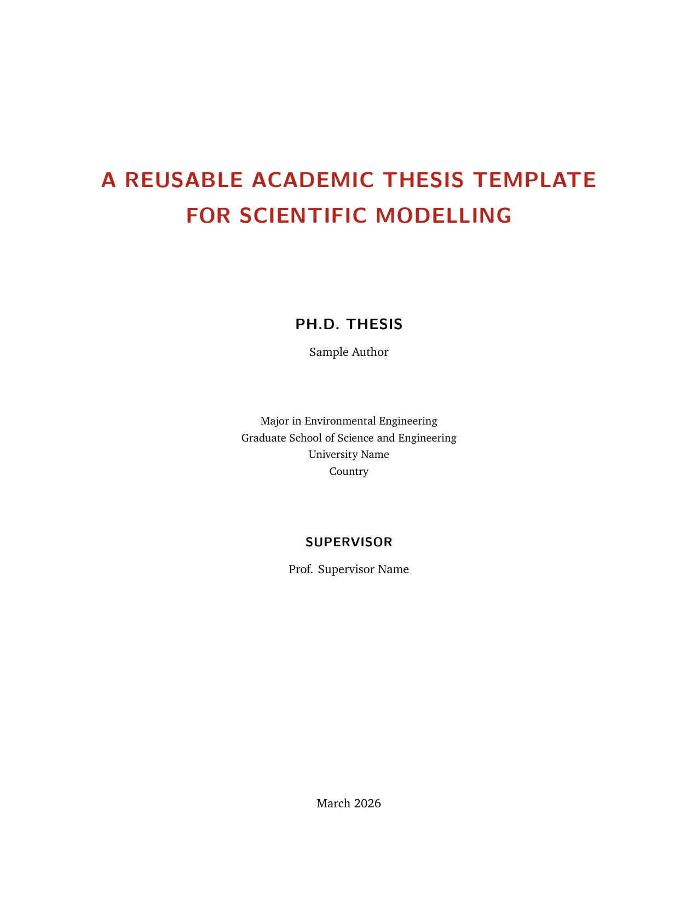
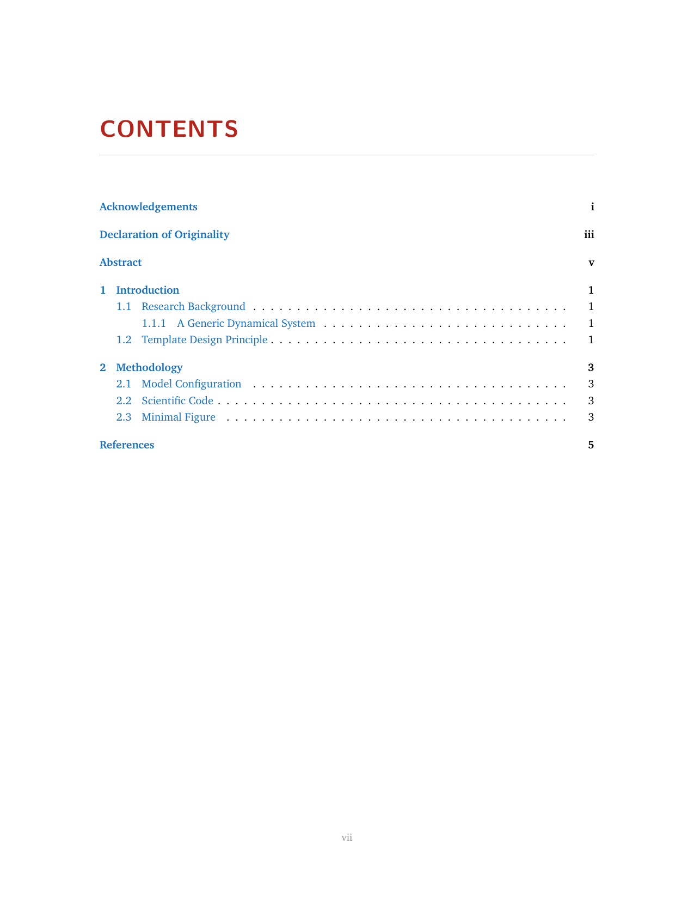
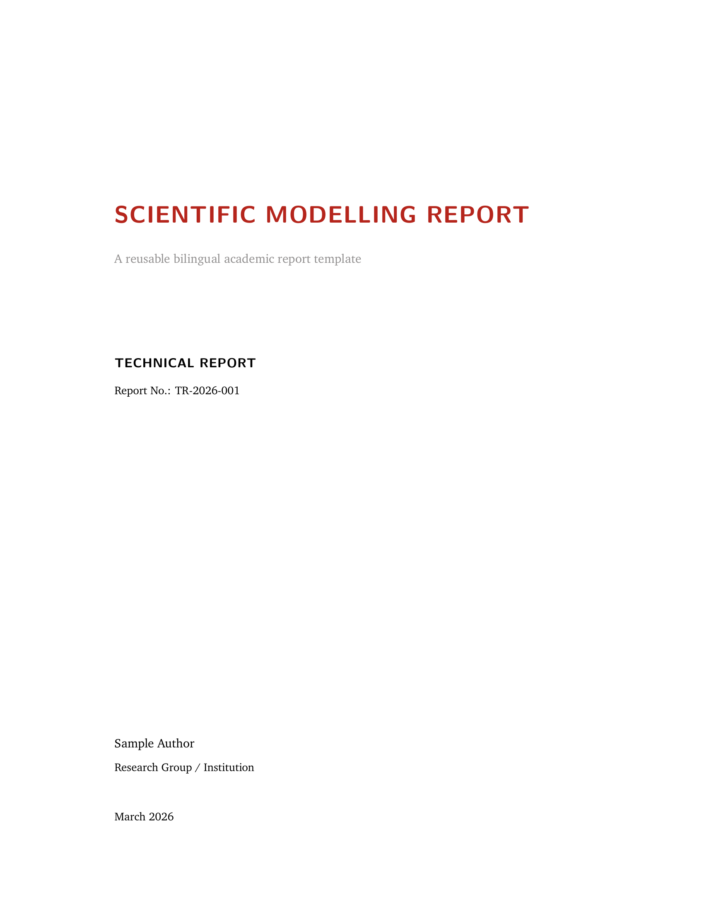
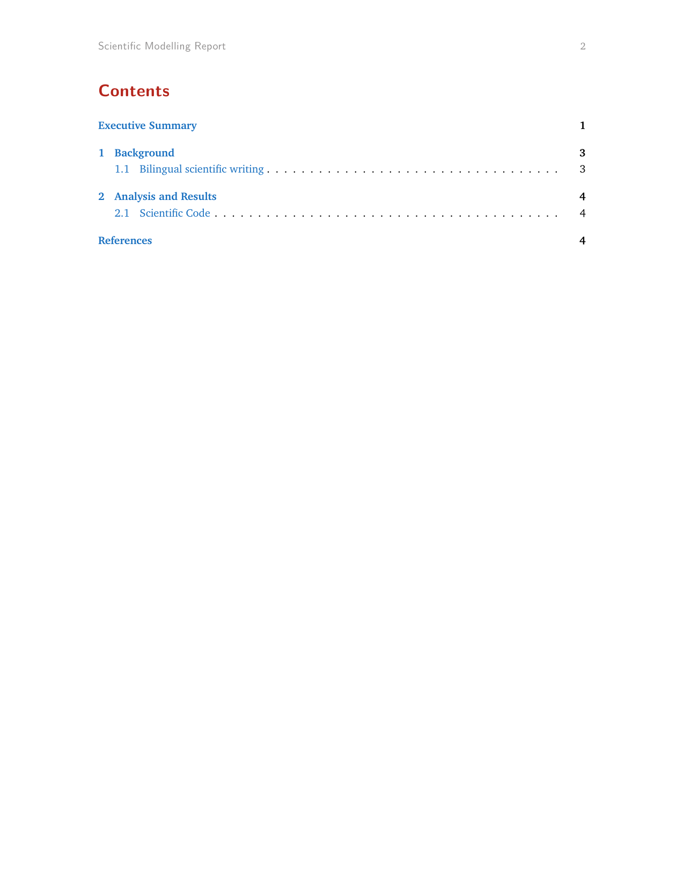
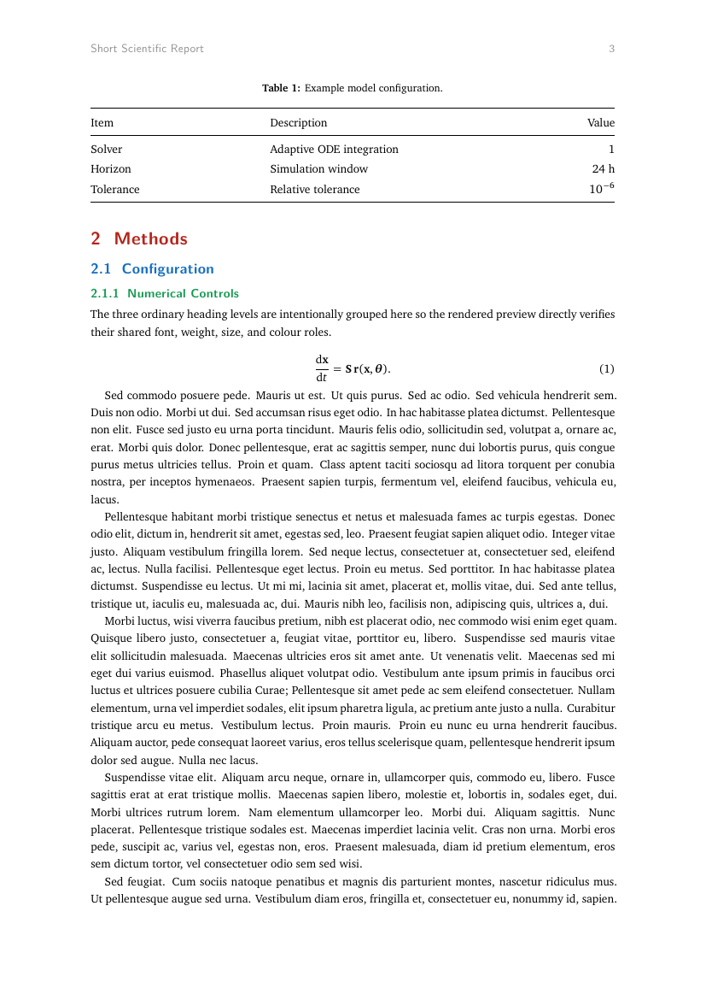
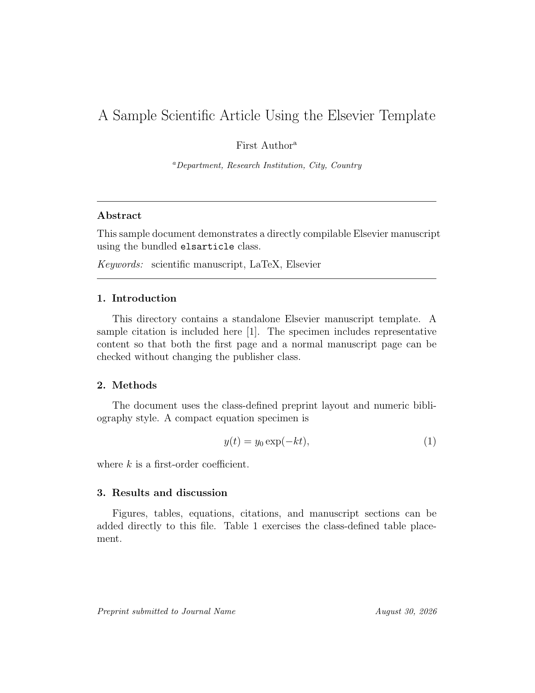
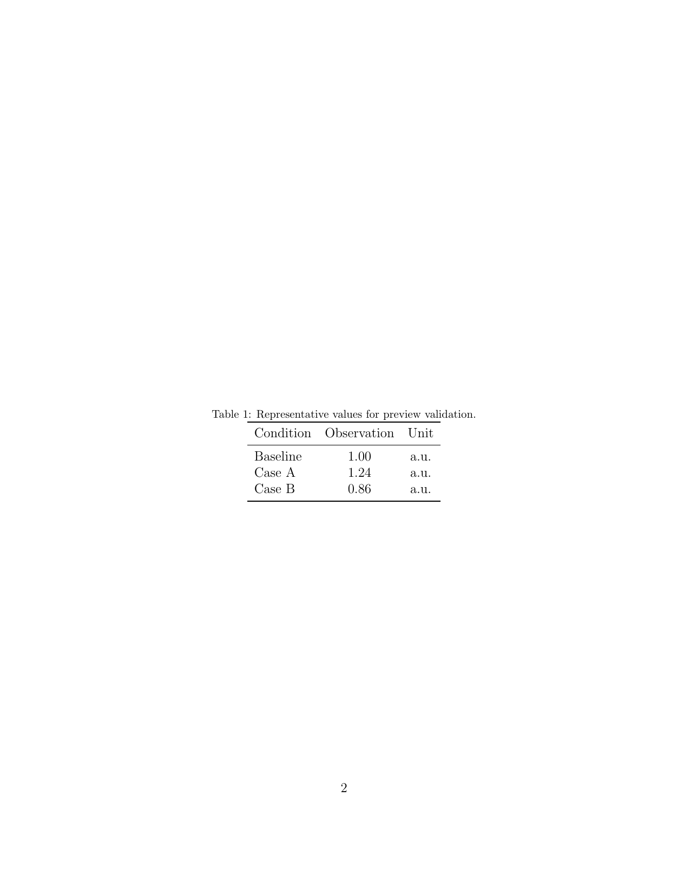

# LaTeX Templates

A collection of reusable LaTeX templates for academic writing, journal manuscripts, grant applications, reports, theses, and CVs. Each template is directly usable from its own directory.

## Templates

| Category | Template | Engine | Purpose |
| --- | --- | --- | --- |
| Thesis | [`thesis/classic-academic`](thesis/classic-academic/) | XeLaTeX | Dissertation / monograph |
| Report | [`report/classic-academic`](report/classic-academic/) | XeLaTeX | Full scientific / technical report |
| Report | [`report/short-charter`](report/short-charter/) | XeLaTeX | Compact 8–12 page report; no TOC by default |
| Journal | [`journal/nature`](journal/nature/) | pdfLaTeX | Springer Nature `sn-jnl`, Nature reference style |
| Journal | [`journal/elsevier`](journal/elsevier/) | pdfLaTeX | Elsevier `elsarticle` |
| Journal | [`journal/acs`](journal/acs/) | pdfLaTeX | ACS `achemso` |
| Journal | [`journal/kxtbcas`](journal/kxtbcas/) | XeLaTeX | KXTB-CAS / 科学通报 manuscript |
| NSFC | [`nsfc-general`](nsfc-general/) | XeLaTeX | 2026 面上项目 |
| NSFC | [`nsfc-young`](nsfc-young/) | XeLaTeX | 2026 青年科学基金项目（C类） |
| CV | [`cv/curve-academic`](cv/curve-academic/) | XeLaTeX | Academic CV |

## Style specification

[`STYLE_SPEC.md`](STYLE_SPEC.md) is a design reference for the self-owned thesis, report, and CV templates. It is not a runtime font layer. Every template keeps its own font declarations, font directory, and build script inside that template directory; one template never loads another template's font files or font configuration.

The self-owned templates currently use the same design roles where applicable—XCharter, XCharter-Math, Latin Modern Sans, LXGW WenKai Screen, and Maple Mono—but each template resolves its own runtime resources independently. Publisher and NSFC templates retain their own class-defined typography.

## Journal templates

| Directory | Class | Reference style | Source |
| --- | --- | --- | --- |
| `journal/nature` | `sn-jnl.cls` | `sn-nature.bst` | Springer Nature resource |
| `journal/elsevier` | `elsarticle.cls` | `elsarticle-num.bst` | Elsevier resource |
| `journal/acs` | `achemso.cls` | class-managed ACS style | CTAN `achemso` |
| `journal/kxtbcas` | `kxtbcas.cls` | `kxtbcas-numeric.bst` | KXTB-CAS / 科学通报 project resource |

The KXTB-CAS template follows the font contract of the `structure-object-perspective` reference class: Times New Roman for Latin text, SimSun for Chinese text, and STIX Two Math for mathematics. These exact font files are bundled inside `journal/kxtbcas/fonts/`; the class does not select substitute families. The NSFC templates likewise use their own bundled Arial, SimSun, KaiTi, and FangSong files.

## Rendered previews

All committed preview PNGs are generated from PDFs compiled from source files in this repository and rendered directly at 150 DPI. Every template except the CV exposes two preview pages. Each pair is generated from pages with the same PDF page geometry, and CI rejects any pair whose PNG pixel dimensions differ. The CV remains a single-page preview and is listed last.

### Thesis · Classic Academic

<table>
<tr><th width="50%">Title page</th><th width="50%">Hierarchy specimen</th></tr>
<tr><td width="50%"></td><td width="50%"></td></tr>
</table>

### Report · Classic Academic

<table>
<tr><th width="50%">Title page</th><th width="50%">Hierarchy specimen</th></tr>
<tr><td width="50%"></td><td width="50%"></td></tr>
</table>

### Report · Short Charter

<table>
<tr><th width="50%">Title page</th><th width="50%">Hierarchy specimen</th></tr>
<tr><td width="50%"></td><td width="50%"></td></tr>
</table>

### Journal · Springer Nature

<table>
<tr><th width="50%">First page</th><th width="50%">Content page</th></tr>
<tr><td width="50%"></td><td width="50%"></td></tr>
</table>

### Journal · Elsevier

<table>
<tr><th width="50%">First page</th><th width="50%">Content page</th></tr>
<tr><td width="50%"></td><td width="50%"></td></tr>
</table>

### Journal · ACS

<table>
<tr><th width="50%">First page</th><th width="50%">Content page</th></tr>
<tr><td width="50%"></td><td width="50%"></td></tr>
</table>

### Journal · KXTB-CAS / 科学通报

<table>
<tr><th width="50%">First page</th><th width="50%">Content page</th></tr>
<tr><td width="50%"></td><td width="50%"></td></tr>
</table>

### NSFC · 2026 面上项目

<table>
<tr><th width="50%">First page</th><th width="50%">Content page</th></tr>
<tr><td width="50%"></td><td width="50%"></td></tr>
</table>

### NSFC · 2026 青年科学基金项目（C类）

<table>
<tr><th width="50%">First page</th><th width="50%">Content page</th></tr>
<tr><td width="50%"></td><td width="50%"></td></tr>
</table>

### CV · Academic CurVe

## Sources

- Springer Nature `sn-jnl`: https://www.springernature.com/gp/authors/campaigns/latex-author-support
- Elsevier LaTeX instructions: https://www.elsevier.com/researcher/author/policies-and-guidelines/latex-instructions
- ACS `achemso`: https://ctan.org/pkg/achemso
- KXTB-CAS reference: https://github.com/cigit-zgy/structure-object-perspective
- KXTB-CAS manuscript workflow: https://github.com/cigit-zgy/sci-manuscript-skill
- NSFC reference: https://github.com/andy123t/nsfc-latex
- CurVe CV reference: https://www.overleaf.com/latex/templates/a-customised-curve-cv/mvmbhkwsnmwv

## Constraints

- One template directory contains one directly usable template and owns its own runtime font resolution.
- `STYLE_SPEC.md` is descriptive; it is not a shared runtime font configuration.
- Publisher class and bibliography files under `journal/nature`, `journal/elsevier`, and `journal/acs` retain publisher-defined typography and are not restyled.
- `journal/kxtbcas` retains KXTB-CAS layout rules and uses its bundled Times New Roman + SimSun + STIX Two Math files.
- `nsfc-general` and `nsfc-young` retain their NSFC typography and page geometry with template-local Arial, SimSun, KaiTi, and FangSong.
- Every preview validates the current repository template by compiling that template's own `main.tex`; CI does not reuse a precompiled PDF from a reference repository.
- All non-CV preview sets contain exactly two displayed pages at 150 DPI, and each pair must have identical PNG pixel dimensions.
- The CV preview contains one page and is displayed last.
- Report manuscript tables use the full `\linewidth` through `AcademicTable`.
- `report/short-charter` has no table of contents by default.
- Preview PNGs are generated with `pdftoppm -png -r 150` and are not cropped, resized, composited, sharpened, annotated, or redrawn.
