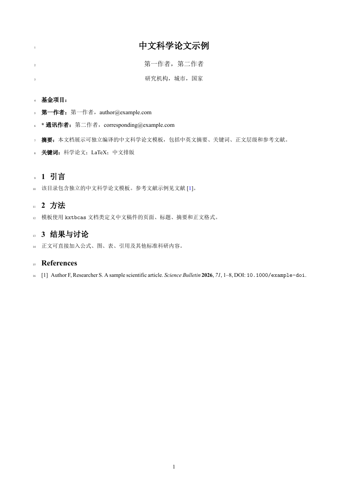
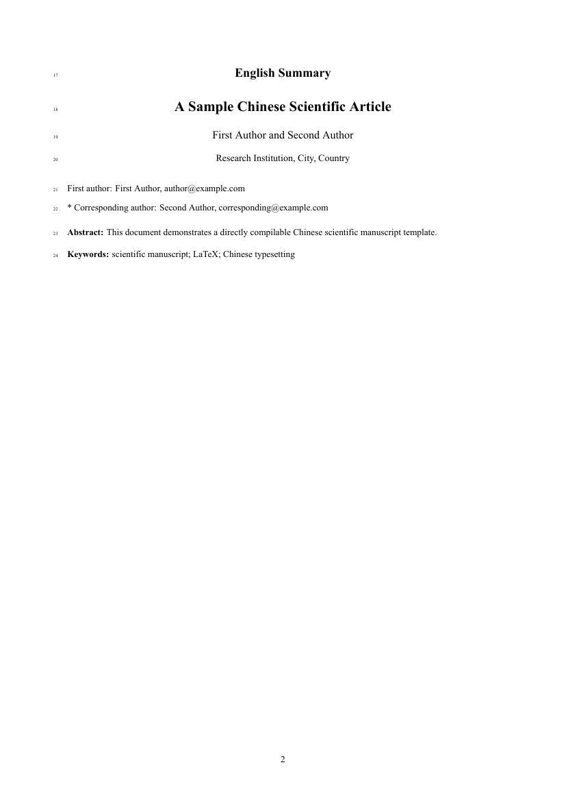
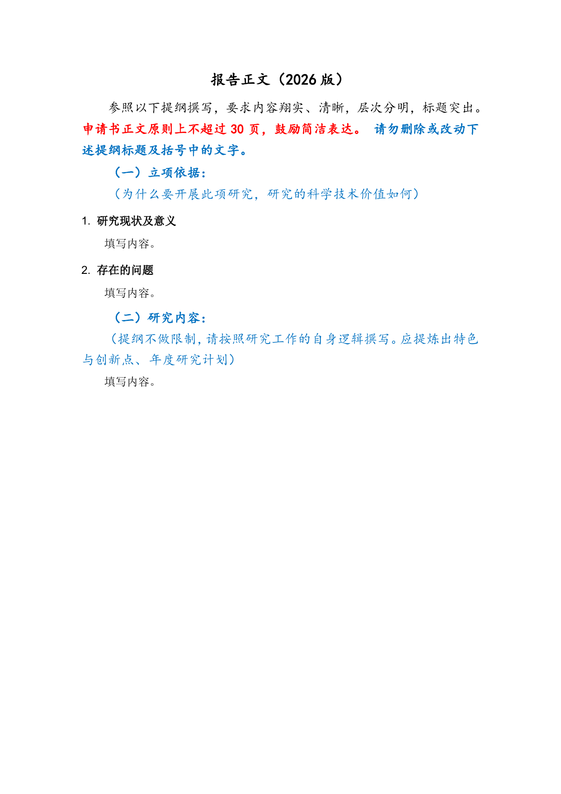
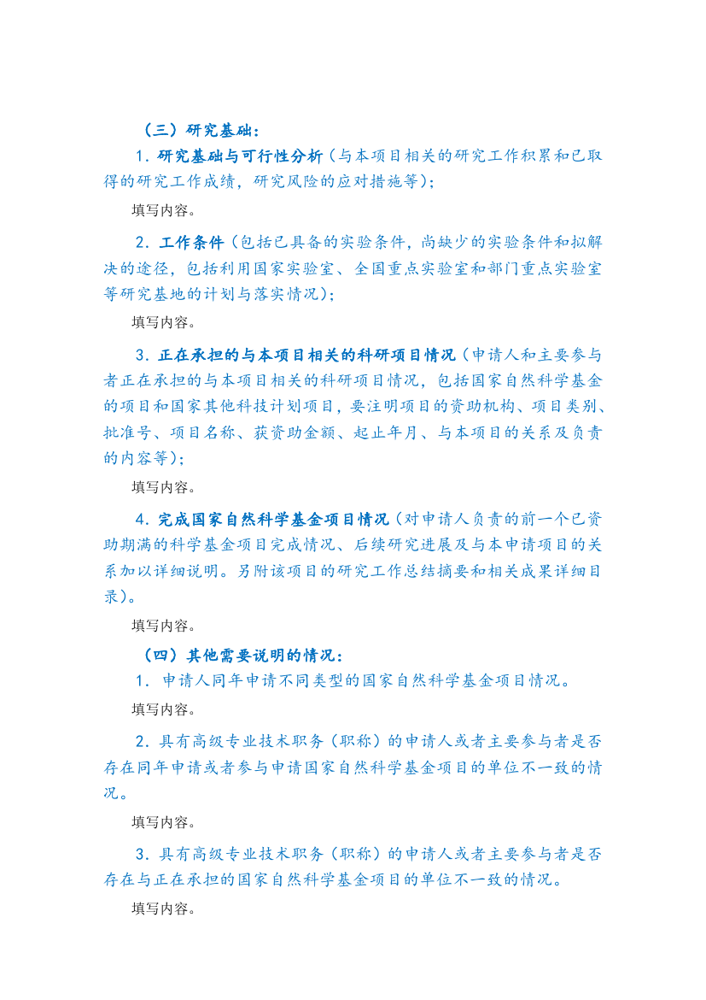

# LaTeX Templates

A collection of reusable LaTeX templates for academic writing, journal manuscripts, grant applications, reports, theses, and CVs. Each template is directly usable from its own directory.

## Templates

| Category | Template | Engine | Purpose |
| --- | --- | --- | --- |
| Thesis | [`thesis/classic-academic`](thesis/classic-academic/) | XeLaTeX | Dissertation / monograph |
| Report | [`report/classic-academic`](report/classic-academic/) | XeLaTeX | Full scientific / technical report |
| Report | [`report/short-charter`](report/short-charter/) | XeLaTeX | Compact 8–12 page report; no TOC by default |
| CV | [`cv/curve-academic`](cv/curve-academic/) | XeLaTeX | Academic CV |
| Journal | [`journal/nature`](journal/nature/) | pdfLaTeX | Springer Nature `sn-jnl`, Nature reference style |
| Journal | [`journal/elsevier`](journal/elsevier/) | pdfLaTeX | Elsevier `elsarticle` |
| Journal | [`journal/acs`](journal/acs/) | pdfLaTeX | ACS `achemso` |
| Journal | [`journal/kxtbcas`](journal/kxtbcas/) | XeLaTeX | KXTB-CAS / 科学通报 manuscript |
| NSFC | [`nsfc-general`](nsfc-general/) | XeLaTeX | 2026 面上项目 |
| NSFC | [`nsfc-young`](nsfc-young/) | XeLaTeX | 2026 青年科学基金项目（C类） |

## Style specification

[`STYLE_SPEC.md`](STYLE_SPEC.md) is a design reference for the self-owned thesis, report, and CV templates. It is not a runtime font layer. Every template keeps its own font declarations, font staging directory, and build script inside that template directory; one template never loads another template's font files or font configuration.

The self-owned templates currently use the same design roles where applicable—XCharter, XCharter-Math, Latin Modern Sans, LXGW WenKai Screen, and Maple Mono—but each template resolves its own runtime resources independently. Publisher and NSFC templates retain their own class-defined typography.

## Journal templates

| Directory | Class | Reference style | Source |
| --- | --- | --- | --- |
| `journal/nature` | `sn-jnl.cls` | `sn-nature.bst` | Springer Nature resource |
| `journal/elsevier` | `elsarticle.cls` | `elsarticle-num.bst` | Elsevier resource |
| `journal/acs` | `achemso.cls` | class-managed ACS style | CTAN `achemso` |
| `journal/kxtbcas` | `kxtbcas.cls` | `kxtbcas-numeric.bst` | KXTB-CAS / 科学通报 project resource |

The KXTB-CAS template follows the font contract of the `structure-object-perspective` reference class: Times New Roman for Latin text and SimSun for Chinese text, with the class display roles mapped to the same serif files. Its local `scripts/setup-fonts.sh` stages legally installed exact fonts into `journal/kxtbcas/fonts/`; missing exact files stop the build rather than selecting a substitute.

## Rendered previews

All committed preview PNGs are 100-dpi renders of compiled PDFs. Templates that require proprietary local fonts use a pinned, already compiled reference PDF for preview generation, so the preview does not silently switch to substitute fonts in CI. Preview provenance is recorded inside each template's `preview/README.md` where a reference PDF is used.

### Thesis · Classic Academic

### Report · Classic Academic

### Report · Short Charter

### CV · Academic CurVe

### Journal · Springer Nature

### Journal · Elsevier

### Journal · ACS

### Journal · KXTB-CAS / 科学通报

### NSFC · 2026 面上项目

### NSFC · 2026 青年科学基金项目（C类）

## Sources

- Springer Nature `sn-jnl`: https://www.springernature.com/gp/authors/campaigns/latex-author-support
- Elsevier LaTeX instructions: https://www.elsevier.com/researcher/author/policies-and-guidelines/latex-instructions
- ACS `achemso`: https://ctan.org/pkg/achemso
- KXTB-CAS reference: https://github.com/cigit-zgy/structure-object-perspective
- KXTB-CAS manuscript workflow: https://github.com/cigit-zgy/sci-manuscript-skill
- NSFC reference: https://github.com/andy123t/nsfc-latex
- CurVe CV reference: https://www.overleaf.com/latex/templates/a-customised-curve-cv/mvmbhkwsnmwv

## Constraints

- One template directory contains one directly usable template and owns its own runtime font resolution.
- `STYLE_SPEC.md` is descriptive; it is not a shared runtime font configuration.
- Publisher class and bibliography files under `journal/nature`, `journal/elsevier`, and `journal/acs` retain publisher-defined typography and are not restyled.
- `journal/kxtbcas` retains KXTB-CAS layout rules and requires exact Times New Roman + SimSun font files.
- `nsfc-general` and `nsfc-young` retain their NSFC typography and page geometry.
- Proprietary-font previews are rendered from pinned reference PDFs, not from substitute-font CI builds.
- Report manuscript tables use the full `\linewidth` through `AcademicTable`.
- `report/short-charter` has no table of contents by default.
- Preview PNGs are generated with `pdftoppm -png -r 100` and are not cropped, resized, composited, sharpened, annotated, or redrawn.
- README image markup does not set explicit width or height.
