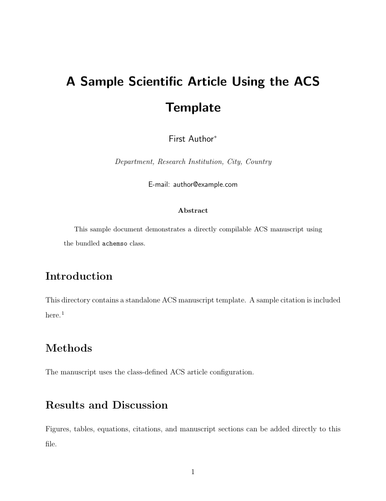
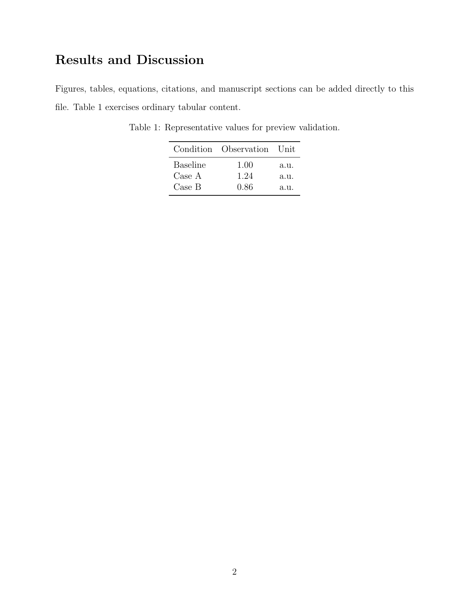

# ACS Journal Template

## Overview

Standalone ACS journal manuscript using the `achemso` class distributed through CTAN. The sample uses `journal=esthag` and `manuscript=article`.

## Files

- `main.tex` — directly compilable two-page-or-longer sample manuscript.
- `achemso.cls` — ACS manuscript class.
- `achemso.dtx` — package source file.
- `LICENSE.md` — package license.
- `references.bib` — sample bibliography.
- `preview/article.png` / `preview/content.png` — first and second preview pages.

## Build

```bash
latexmk -pdf -interaction=nonstopmode -halt-on-error main.tex
```

## Preview

<table>
<tr><th width="50%">First page</th><th width="50%">Content page</th></tr>
<tr><td width="50%"></td><td width="50%"></td></tr>
</table>

Both PNGs are direct 150-DPI renders from the current repository PDF and must have identical pixel dimensions.

## Source

- Publisher guidance: https://pubs.acs.org/page/4authors/submission_guide
- Package source: https://ctan.org/pkg/achemso
- Migrated from: `cigit-zgy/sci-manuscript-skill`
- Source commit: `69adcab3e0d40e4e0eb42038f685cc6125050cc6`
- `achemso` version: 3.14 (2025-09-22).
- License: LPPL 1.3c.

## Constraints

- `achemso.cls`, `achemso.dtx`, and `LICENSE.md` are retained as source resources without style changes.
- Target-journal Author Guidelines remain authoritative.
- The sample manuscript contains at least two pages solely to exercise opening-page and body-page preview behavior.
- Preview PNGs are direct 150-DPI PDF renders with equal dimensions.
