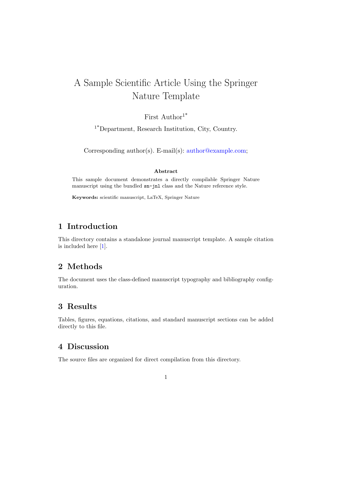
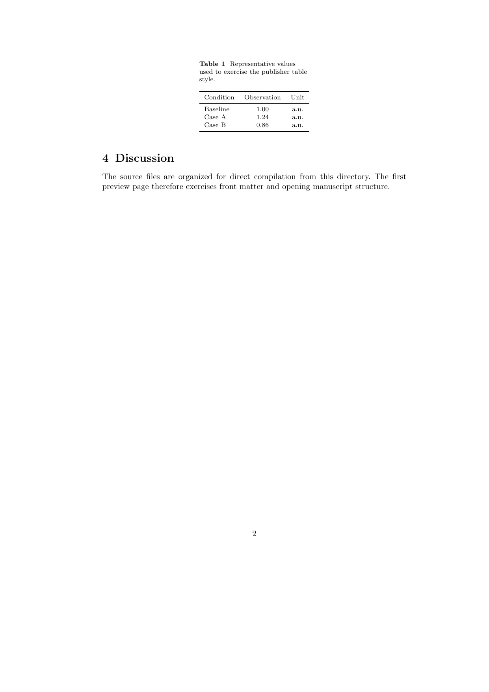

# Springer Nature Journal Template

## Overview

Standalone Springer Nature journal manuscript using `sn-jnl.cls` with the `sn-nature` reference style.

## Files

- `main.tex` — directly compilable two-page-or-longer sample manuscript.
- `sn-jnl.cls` — Springer Nature class resource.
- `sn-nature.bst` — Nature reference style.
- `references.bib` — sample bibliography.
- `NOTICE.md` — source and license information.
- `preview/article.png` / `preview/content.png` — first and second preview pages.

## Build

```bash
latexmk -pdf -interaction=nonstopmode -halt-on-error main.tex
```

## Preview

<table>
<tr><th width="50%">First page</th><th width="50%">Content page</th></tr>
<tr><td width="50%"></td><td width="50%"></td></tr>
</table>

Both PNGs are direct 150-DPI renders from the current repository PDF and must have identical pixel dimensions.

## Source

- Publisher source: https://www.springernature.com/gp/authors/campaigns/latex-author-support
- Migrated from: `cigit-zgy/sci-manuscript-skill`
- Source commit: `69adcab3e0d40e4e0eb42038f685cc6125050cc6`
- Resource version: December 2024 package; class header 0.1 (2019-11-18).
- Class license: LPPL 1.3c or later.

## Constraints

- `sn-jnl.cls` and `sn-nature.bst` are retained as source resources without style changes.
- This directory represents the Springer Nature `sn-jnl` template with Nature reference style; it is not a universal class for every Nature Portfolio journal.
- Target-journal submission requirements remain authoritative.
- The sample manuscript contains at least two pages solely to exercise both opening-page and body-page preview behavior.
- Preview PNGs are direct 150-DPI PDF renders with equal dimensions.
