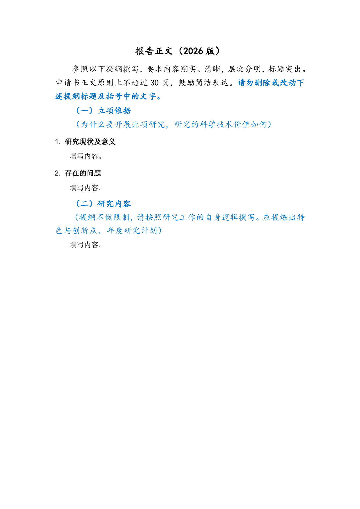
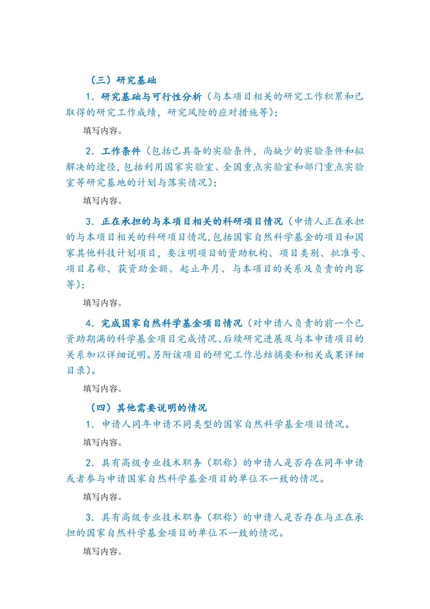

# 青年科学基金项目（C类，2026）LaTeX 模板

该目录是一套完整、独立、可单独复制的青年科学基金项目正文模板，不依赖 Git submodule、符号链接、上级目录文件或另一个模板。

## 目录

```text
nsfc-young/
├── main.tex
├── nsfc.cls
├── references.bib
├── README.md
├── sections/
│   ├── 01-basis.tex
│   ├── 02-content.tex
│   ├── 03-foundation.tex
│   └── 04-other.tex
├── figures/
│   └── README.md
├── fonts/
│   └── README.md
└── preview/
    ├── application.png
    └── content.png
```

`main.tex` 只负责文档配置和装配；申请书正文按基金委提纲拆分在 `sections/`。图片统一放入 `figures/`，参考文献统一写入 `references.bib`。

## 固定字体与版式

模板保持基金委版式所用的宋体、楷体、仿宋和 Arial，以及青年项目 A4 页面左右边距 3.2 cm。模板不使用仓库其他文档的 XCharter 字体与彩色标题体系，也不设置替代中文字体。

编译前需将合法取得的以下字体文件分别放入本模板自己的 `fonts/`：

```text
SimSun.ttf
KaiTi.ttf
FangSong.ttf
```

字体文件不在本仓库中二次分发。

## 编译

```bash
xelatex main.tex
bibtex main
xelatex main.tex
xelatex main.tex
```

## 预览

由于 CI 环境不持有上述专有字体，预览直接从固定上游提交 `11a02726f6190fcb89859dfaed18e3d1d68af0b8` 已编译的 `main-YF.pdf` 提取，避免使用替代字体生成失真的预览。仓库保存首页与正文页两个 100-DPI PNG。





## 来源

2026 年青年科学基金项目（C类）提纲、字体和页面几何参数参考 `andy123t/nsfc-latex`，固定参考提交为 `11a02726f6190fcb89859dfaed18e3d1d68af0b8`，对应上游入口 `main-YF.tex` 与预览 PDF `main-YF.pdf`。通用 NSFC 排版与写作组织同时参考 `MCG-NKU/NSFC-LaTex`，固定参考提交为 `3f69bc50dc6d44ef8330a21e585e043addb5cf8d`。

两个上游仓库当前均未声明仓库级许可证，因此本目录明确记录来源，且不复制受限字体；预览仅由公开的已编译 PDF 生成。
