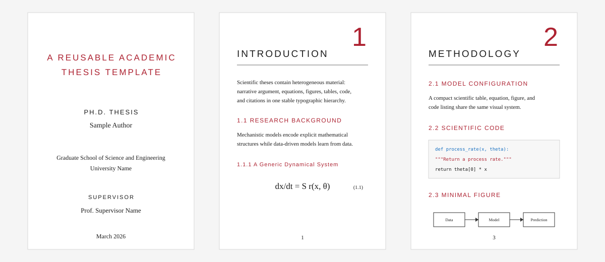

# Classic Academic Thesis

A reusable XeLaTeX dissertation template inspired by the typographic architecture of ClassicThesis and calibrated against a completed scientific doctoral dissertation.

The implementation is independent: it uses standard LaTeX packages and keeps the visual system modular so the template can evolve without coupling scientific content to formatting code.

## Preview

<p align="center">
  
</p>


## Architecture

```text
classic-academic/
├── main.tex
├── latexmkrc
├── config/                 # Project-specific values
│   ├── metadata.tex
│   └── theme.tex
├── style/                  # Template infrastructure
│   ├── typography.tex
│   ├── layout.tex
│   └── components.tex
├── frontmatter/            # Thesis front matter
│   ├── titlepage.tex
│   ├── acknowledgements.tex
│   ├── declaration.tex
│   └── abstract.tex
├── chapters/               # Scientific content
│   ├── 01-introduction.tex
│   └── 02-methodology.tex
├── bibliography/
│   └── references.bib
├── figures/
└── preview/                # Generated visual examples
```

The boundary is intentional:

- `config/` is the normal customization surface.
- `style/` is template infrastructure and should remain stable during ordinary writing.
- `frontmatter/`, `chapters/`, `bibliography/`, and `figures/` contain manuscript content.
- `preview/` contains generated outputs for repository visitors.

## Typography

| Role | Font |
| --- | --- |
| Body | Latin Modern Roman |
| Headings / sans-serif | Latin Modern Sans |
| Mathematics | Latin Modern Math |
| Code | Maple Mono if installed; Latin Modern Mono fallback |

No font files are included in the repository.

## Visual system

The page architecture uses a large outer-aligned chapter numeral, tracked uppercase chapter titles, restrained coloured section headings, thin rules, asymmetric running heads, Roman-numbered front matter, and Arabic-numbered main matter.

All project colours are defined only in `config/theme.tex`.

## Normal use

For a new thesis:

1. Copy the complete `classic-academic/` directory into a new project.
2. Edit `config/metadata.tex`.
3. Adjust `config/theme.tex` only when a different palette is required.
4. Replace the sample files in `frontmatter/` and `chapters/`.
5. Add references to `bibliography/references.bib` and figures to `figures/`.
6. Keep `style/` unchanged unless intentionally developing a new template version.

## Build

```bash
latexmk -xelatex main.tex
```

Clean temporary files:

```bash
latexmk -C
```

The bibliography uses `biblatex` + `biber`; `latexmk` handles the required passes.

## Content rules

- Keep visual formatting out of chapter files.
- Use semantic LaTeX commands and labels.
- Use `01-`, `02-`, ... prefixes for chapter filenames.
- Use labels such as `fig:<chapter>:<name>`, `tab:<chapter>:<name>`, `eq:<chapter>:<name>`, and `sec:<chapter>:<name>`.
- Prefer vector figures for diagrams and plots.
